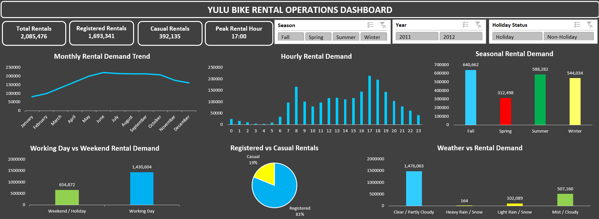

# Yulu Bike Rental Operations Dashboard

An Excel-based dashboard analyzing Yulu bike rental demand across time,
season, customer type, working days, holidays, and weather conditions.

## Dashboard Preview

## Key Insights

- Total Rentals: 2,085,476
- Registered Rentals: 81% of total rentals
- Casual Rentals: 19% of total rentals
- Peak Rental Hour: 17:00
- Fall recorded the highest seasonal rental demand.
- Working days generated higher rental demand than weekends/holidays.
- Clear/partly cloudy weather recorded the highest rental demand.

## Tools & Skills

- Microsoft Excel
- Pivot Tables & Pivot Charts
- Slicers
- Data Analysis
- Data Visualization

## Project Report

[View Detailed Project Report](Yulu_Bike_Rental_Operations_Dashboard.pdf)
